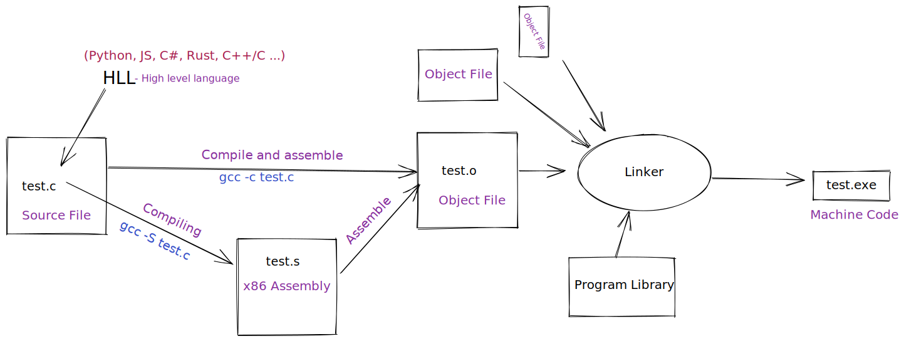

- Compile time - во время компиляции = значит до запуска программы
- Run time - во время работы программы = после запуска
- Runtime (слитно) - среда выполнения кода =
  - Виртуальная Машина (в случае C\# -- .NET CLR / Java -- JVM ) или ОС (в случае C/C++)
    - \+ все библиотеки, которые нужны для выполнения программы

- Свойства через C\# {get; set; } -- свойства с автоматическими методами = авто-свойства (auto-property)
- Исключения (*) - это способ вызвать распространение "контролируемой ошибки", в случае когда логика в конкретном месте не может справится с ошибкой.
  - если для созданного исключения не существует обработчиков, выполнение программы прекращается с сообщением об ошибке.
- VM - виртуальная машина - "операционная система" внутри ОС
- [ ] [Интерполяция строк](https://docs.microsoft.com/ru-ru/dotnet/csharp/language-reference/tokens/interpolated)

___
15.09.22

- `internal <class>` - доступ к классу внутри сборки = грубо говоря внутри проекта .csproj
- рефлексия .NET - возможность получать доступ (и модифицировать) в run time к данным о данных выполняющегося сейчас кода (внутри сборки)
- интерфейс - контракт, указывающий, какие методы (включая сигнатуру - название метода, тип аргументов и тип возвращаемого значения), класс, или структура должны реализовывать, чтобы выполнять этот контракт
  - интерфейс в C\# является типом, а соответственно типы, выполняющие его - его подтипами

___
17.09.22

- Ограничения параметров типа, пример:
  - `class List<T> : IList<T> where T: notnull` - синтаксис позволяющий задать ограничения для типов в compile time.

- Индексеры:
    Индексаторы позволяют индексировать объекты так же, как и массивы или другие коллекции.

    ```csharp
    public T this[int index]
    {
      get => GetAt(index);
      set => SetAt(index, value);
    }
    ```

- Компиляция и исполнение C/C++ vs C#:
  - C/C++ 
    => Компилируется в машинный код (бинарники под разную архитектуру - x86 vs ARM - не заработают в другой) который исполняется ОС/ЦПУ
  - C\# - компилируется в **байт-код - IL** (Intermediate Language) = CIL = MicroSoft Common Intermediate Language, **который исполняет виртуальная (магическая) машина** - CLR (Common Language Runtime) - он стандартизирован (существует "священная" [документация ECMA 335](https://www.ecma-international.org/publications-and-standards/standards/ecma-335/) в которой подробно описано как он работает) и называется Common Language Infrastructure (CIL)  
  -> множество языков исполняются на одной "платформе" (Компилятор + CLR)

___
23.09.2022

- Упрощение до предела:
  - у компьютера есть -- память и процессор
  - всё что процессор делает - это просто берёт байты из памяти, читает и меняет на другие байты в памяти (умеет только базовые арифм. операции);

- В разных языках предоставляются разные способы (модели) работы с памятью.
- Самое часто встречающиеся понятия - стек и куча (heap), в CLR тоже есть стек и куча.
- Value types & reference types:
  - все типы: int32, int64, uint32/64, float, double, char и др. примитивные типы - называются *типами значений* (value types), содержат само значение как и в С/C++, **выделяются на стеке** + *структуры* `struct` + `enum`.
  - все остальные: любые объекты, любые экземпляры собственных классов... - называются *ссылочными типам* (reference types), содержат ссылку на значение, **выделяются на куче**.

- Таблица `Stack vs Heap`:

|                                         | Stack                                                                                                        | Heap                                                                                                    |
|-----------------------------------------|--------------------------------------------------------------------------------------------------------------|---------------------------------------------------------------------------------------------------------|
| где находится память                    | в RAM                                                                                                        | в RAM                                                                                                   |
| абстрактное устройство                  | просто размеченный "массив памяти"                                                                           | кусок памяти, где объекты хранятся неоднородно                                                          |
| добавление/удаление                     | данные добавляются / удаляются только "сверху", LIFO (last in - first out)                                   | данные могут быть добавлены/удалены в любом порядке                                                     |
| что хранится внутри переменной          | хранится само значение                                                                                       | хранится ссылка на сами данные, кот. лежат в куче                                                       |
| какие типы                              | bool, byte, char, decimal, double, **enum**, float, int, long, sbyte, short, **struct**, uint, ulong, ushort | **всё что наследуется** от `System.Object`, классы, делегаты, *string*\*                                |
| можно переопределить размер выд. памяти | не может быть переопределён после создания объекта типа                                                      | может быть переопределён                                                                                |
| доступ к выделенной памяти              | быстрый                                                                                                      | тоже быстрый, но медленнее, чем у Stack                                                                 |
| как выделяется блок памяти              | зарезервирован в LIFO, самый новый выделенный (самый верхний) - всегда следующий на освобождение             | размер блока не зарезервирован и освобождается в любое время                                            |
| доступность потокам                     | память доступна только потоку в котором выделена                                                             | память доступна любым потокам                                                                           |
| когда очищается                         | когда переменные выходят за границы области видимости                                                        | `¯\_(ツ)_/¯` GC (Garbage collector)                                                                     |
| сборка мусора (GC)                      | -                                                                                                            | специальный поток (*тред*), созданный CLR, который следит за памятью в куче, производит очистку памяти. |

___
to be continued...
